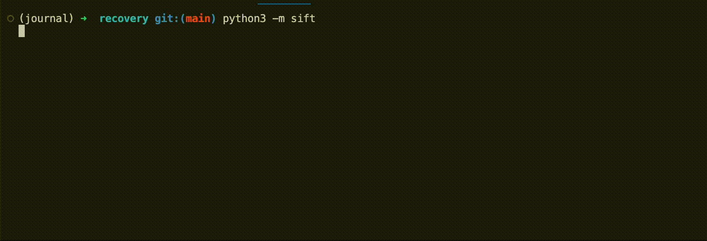

# journal_recovery
A Linux/MacOS Python app I made to recover my personal journal from 80,000 *.rtf file fragments scraped off a backup drive

## Quickstart
First, `git clone --recurse-submodules` the repo

Then `pip3 install -r requirements.txt`

If you have Docker installed: `cd app && docker compose build --no-cache --progress=plain` and then `docker compose up`

Or if you don't have Docker, you can run it directly with Python 3.10+ as `python3 -m sift`

## Detailed instructions
This app is three scripts that run as individual jobs:
* `sort.py` - Sorts files into folders based on similarity to other files
* `prune.py` - Deletes files that are too similar to others in the same sorting folder
* `sift.py` - Runs sort.py and prune.py alternatingly until concensus is achieved

To run any of them directly, use `python3 -m <script name>`. The highest-level application is `sift.py`.

App configuration is held in `app/common.py`. Each script, when run as `__main__`, will load the Config object and set certain parameters based on that script's needs. Everything is hard-coded because I designed my workflow around development tools.
### Environment config

The apps look for files to sort/prune in the path specified by two bits of code:
* In compose.yaml, the host mount points under `volumes:`
* In common.py's Config class, the defines `SOURCE_DIR` and `SORTING_DIR`

If you change a path and want to run this with Docker, change it in both places.
# The story of this project
## Problem
I was using a writer's app called [Scrivener](https://www.literatureandlatte.com/scrivener/) to keep a personal journal. The Scrivener file (which turns out just to be a ZIP of [RTF files](https://en.wikipedia.org/wiki/Rich_Text_Format)) was being sync'd to Dropbox for backup. Unfortunately, I lost both the Dropbox copy and the local copy in a catastrophic event.

Dropbox had also been backed up to a Synology NAS in my home by a cronjob. Hooray! However, the NAS's disk was also wiped in the same event. I used a file recovery tool on the NAS's RAID; it scraped 80,000 RTF file fragments off the disk. All of them were named "File Name Lost (#####).rtf". I knew my journal files were among them, in various stages of completion.

How was I going to find my journal files among the lot and pick out the best versions of each one? I decided to sort these files into copies of the same so I could take the largest of each one as the canonical version. Then I'd go through the (much shorter) list manually and retain the ones that had journal content.

## My Solution
### First pass: sort.py
1. First I have to be able to read these files. How to decode RTF? I found a library: [striprtf](https://github.com/joshy/striprtf)
1. Now how do I compare any two files to see if they're similar?
    1. [thefuzz](https://github.com/seatgeek/thefuzz)
    1. But someone wrote a faster one which is still being updated: [rapidfuzz](https://maxbachmann.github.io/RapidFuzz/Installation.html)
1. Now it's working, but it's way, way too slow
    1. Ask ChatGPT to analyze my code for performance issues: It suggests switching to [Jaccard similarity in NLTK](https://www.nltk.org/_modules/nltk/metrics/distance.html#jaccard_distance)
    1. Jaccard doesn't work quite the way I want, so I modify it to a "pseudo-jaccard" that fits my situation. *(See `pseudo_jaccard_similarity()` in common.py.)*
1. Much faster! Hooray! But it ties up my laptop while running.
    1. Ask ChatGPT for help again. It say, "Run it in the cloud."
1. So I build it into a Docker container for easy deployment.
    1. I've never done that before, so I ask ChatGPT for help again. It writes me some Dockerfile and compose.yaml snippets, and I figure out what they mean.
1. Find a free cloud provider...(lol)
    1. I get $300 in promo credits on GCE, and they have a container optimized OS. Let's go!

### Next: prune.py
After running sort.py with a 70% match threshold, I tarball'd the results and downloaded it to my laptop. Used shell tools to find the largest folders of nonsense (like legal disclaimers, copyright notices, package install scripts, etc.) and delete those up front. This will save some runtime for pruning.
1. Run prunepy to compare files within a sorting directory. If a file isn't similar enough, put it in a pile to be re-sorted. For files that are self-similar, take the largest and delete the rest. Use a higher similarity threshold: 90% rather than the sorting pass's 70%. This is a safety measure to avoid deleting files that are actually different.
1. Test prune.py by running it back and forth with sort.py. Get them to agree on which folder a file should live in (or whether it's just like another and should be deleted).
### Finally: sift.py
When it's working properly with small test batches on my laptop, write a wrapper app that executes sort.py and prune.py alternatingly until concensus is achieved. Run this on the VM because it'll take a long time.

# Ops stuff for my own reference
## Run the container locally
`cd app && docker compose build --no-cache`

`docker compose up`

## Run on GCE VM
Note: vm target platform: `linux/amd64/v4`

### 1. Build and push the container image (dev machine shell)
```bash
docker build --no-cache --platform linux/amd64 -t gcr.io/reliable-return-384618/sort.py-image . \
&& docker push gcr.io/reliable-return-384618/sort.py-image
```

### 2. Bounce the VM (local shell)
`gcloud compute instances stop sortem-worker`

`gcloud compute instances start sortem-worker`

## Utilities
### SSH via terminal. Better just to use Google's shell window in Gcloud web.
`gcloud compute ssh --project=reliable-return-384618 --zone=us-west4-b sortem-worker`
### Make a huge batch of files
`cd ../files && tar cvzf files.tar.gz * && mv files.tar.gz ~/Desktop`
#### Unzip them on the VM (after they’ve been copied using the remote shell window)
`cd ~ && tar xzf files.tar.gz -C ~/source && rm files.tar.gz`
### Check VM progress
Logs: `docker ps -aq | xargs -L 1 docker logs -n 100`
